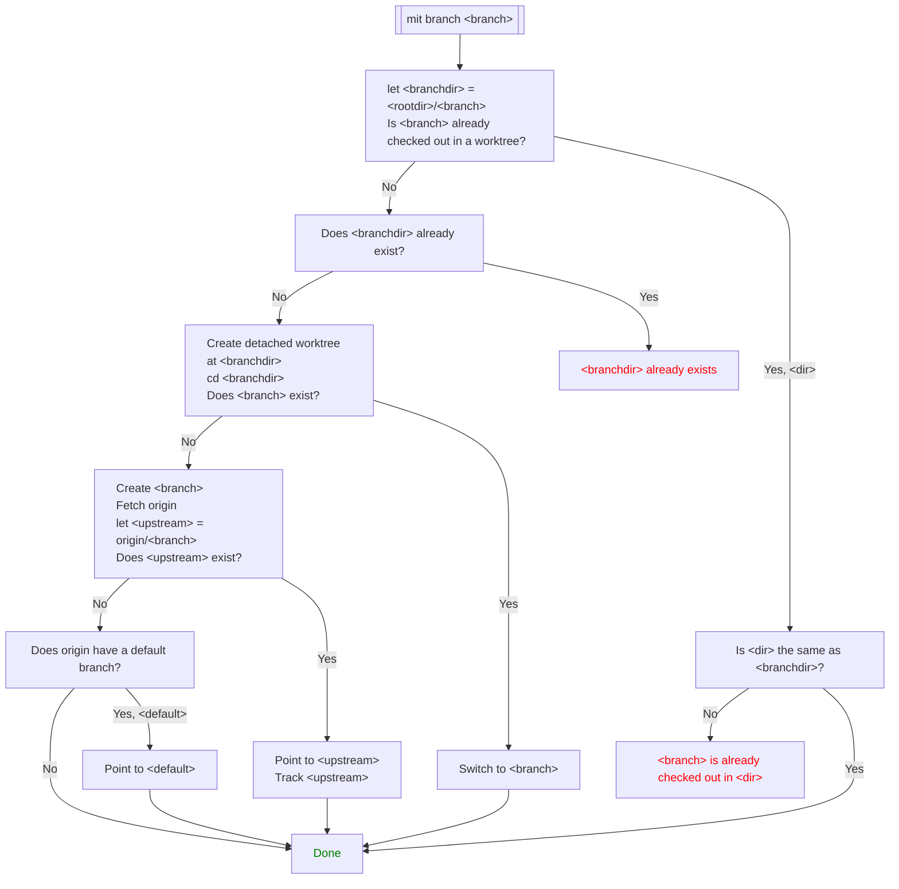

# mit

`mit` is a wrapper around `git` that aims to improve its UX by exposing high-level commands, synchronizing with the
remote repository automatically, providing informative and visual feedback, and allowing the user to undo the last
modification whenever possible.

Compared to `git`, which encourages siloed, offline development until an acceptable level of quality and completeness is
reached and commit history rewritten to show a pristine path, `mit` follows the general philosophy that development
should be iterative and highly collaborative, checkins should occur frequently, history should be preserved accurately,
and it is perfectly okay to have points in the history that do not even build, let alone work correctly.

## The commands

### `mit branch`

### `mit commit`

TODO document this

### `mit merge`

TODO document this

### `mit sync`

TODO document this

### `mit undo`

TODO document this
